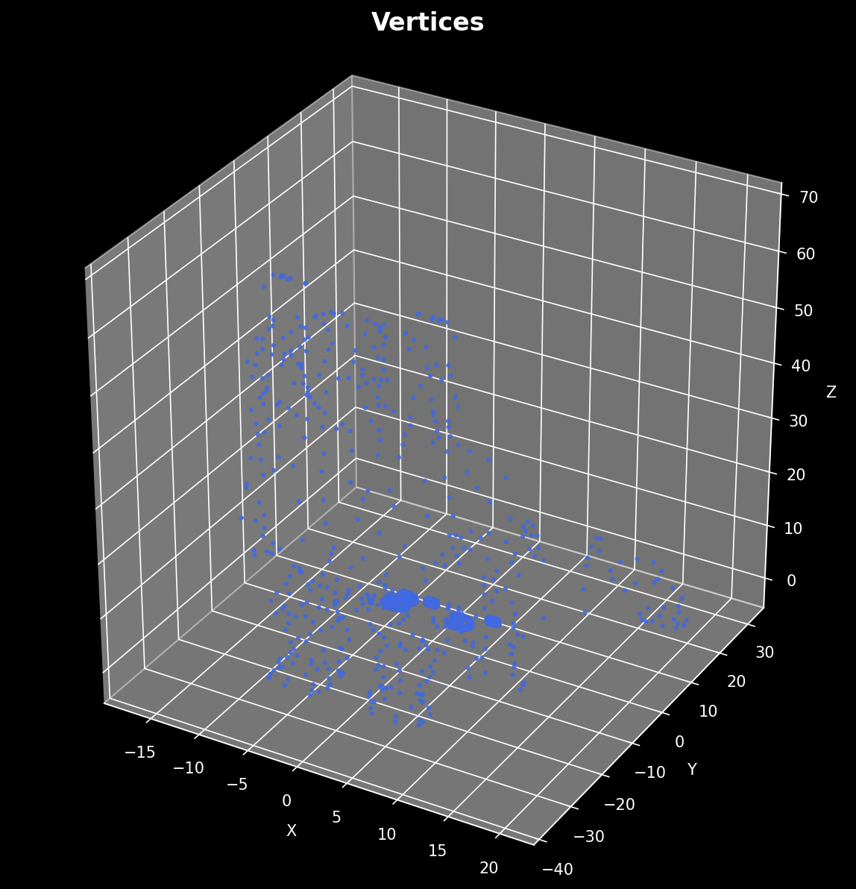
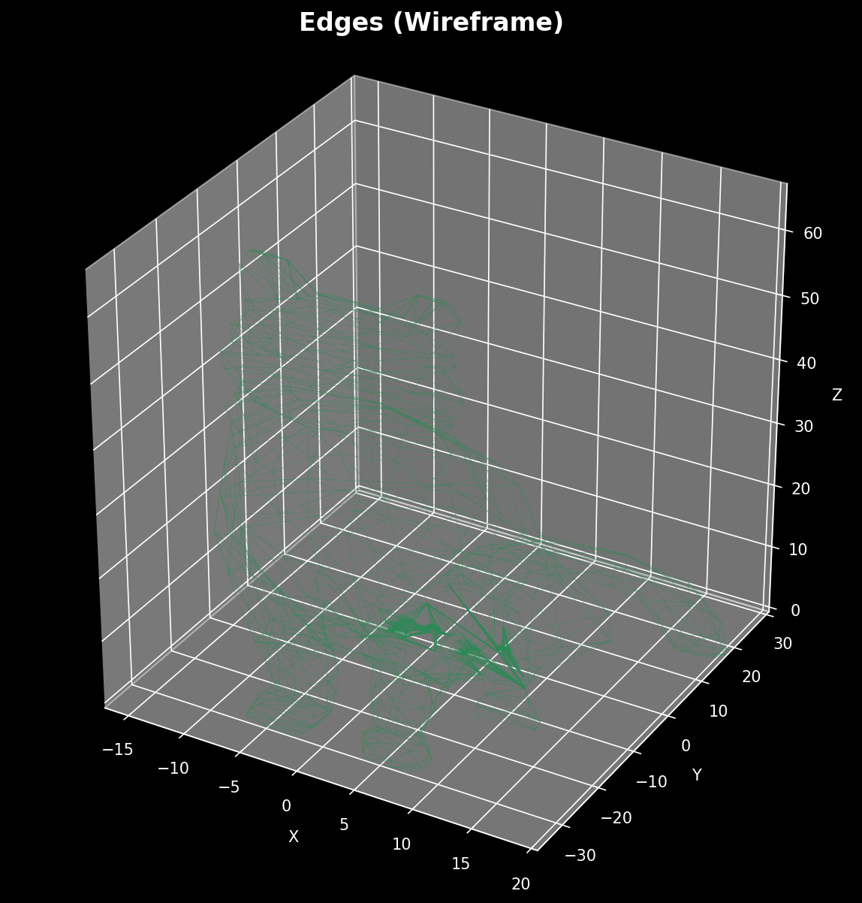
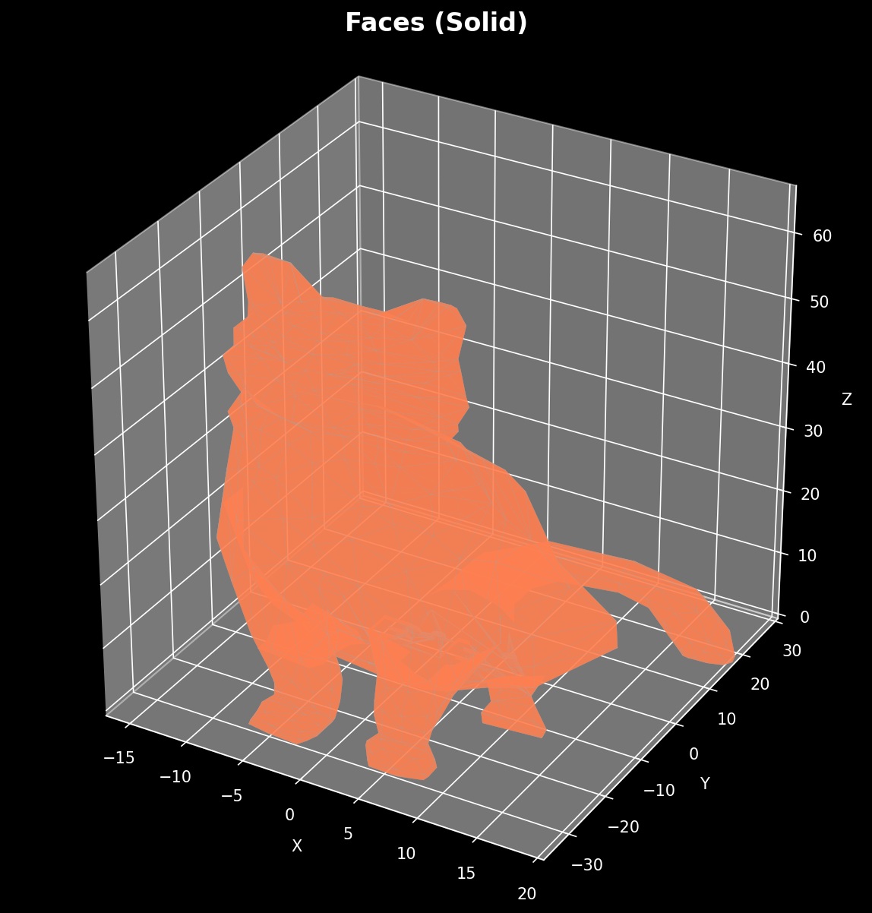
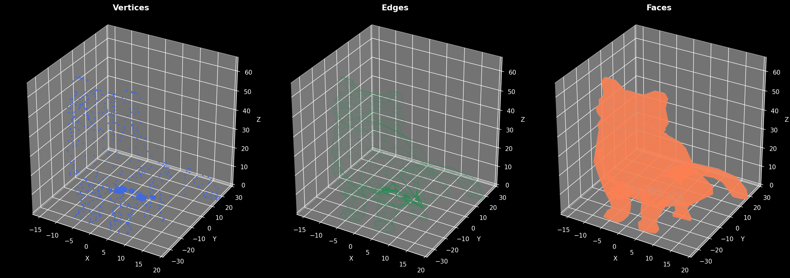
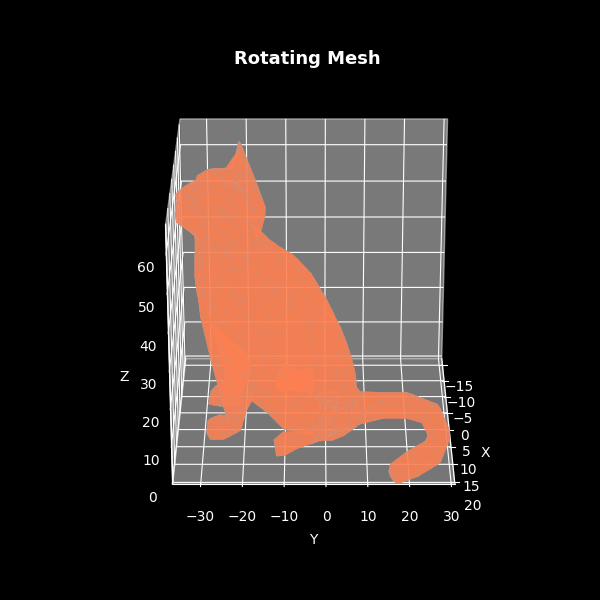

# Taller - Construyendo un Mundo 3D

**Computación Visual - 2025-1**

**Estudiante:** Angel Santiago Avendaño Cañon

**CC:** 1032797547

**Fecha:** 2025

---

## Descripción

Este taller explora los fundamentos de las mallas 3D (vertices, aristas y caras) mediante la visualización de un modelo torus generado proceduralmente. Se implementa en dos entornos:

1. **Python** (Jupyter Notebook) - Generación y visualización estática/animada con trimesh y matplotlib
2. **Three.js** (React Three Fiber) - Visualización interactiva en el navegador con controles en tiempo real

---

## Estructura del Proyecto

```
semana_1_1_construyendo_mundo_3d/
├── python/
│   ├── requirements.txt
│   └── mesh_visualization.ipynb
├── threejs/
│   ├── public/model.glb
│   ├── src/
│   │   ├── App.jsx
│   │   ├── App.css
│   │   └── components/
│   │       ├── ModelViewer.jsx
│   │       ├── Scene.jsx
│   │       └── InfoPanel.jsx
│   └── package.json
├── models/
│   ├── cat.stl
├── media/
│   ├── python_vertices.png
│   ├── python_edges.png
│   ├── python_faces.png
│   ├── python_combined.png
│   └── python_rotation.gif
└── README.md
```

---

## Implementación Python

### Herramientas
- **trimesh**: Generación y análisis de mallas 3D
- **matplotlib**: Visualización 3D con scatter plots, Line3DCollection y Poly3DCollection
- **Pillow**: Generación de GIF animado

### Flujo del Notebook

1. **Generación del modelo**: Se crea un torus con `trimesh.creation.torus()` y se exporta a `.glb` y `.obj`
2. **Análisis estructural**: Se imprimen vértices, aristas, caras, si es watertight, área y volumen
3. **Visualización por componentes**:
   - Vértices como scatter plot (azul)
   - Aristas como wireframe (verde)
   - Caras como malla sólida (coral)
4. **Vista combinada**: Subplot 1x3 y GIF de rotación 360°

### Ejecución

```bash
cd python
pip install -r requirements.txt
jupyter notebook mesh_visualization.ipynb
# Ejecutar todas las celdas
```

### Resultados Visuales

| Vértices | Aristas | Caras |
|----------|---------|-------|
|  |  |  |

**Vista combinada:**



**Rotación animada:**



---

## Implementación Three.js (React Three Fiber)

### Herramientas
- **Vite + React**: Bundler y framework UI
- **Three.js / @react-three/fiber**: Motor de renderizado 3D
- **@react-three/drei**: Helpers (OrbitControls, Grid, useGLTF)
- **leva**: Panel de controles interactivos

### Arquitectura de Componentes

- **`App.jsx`**: Shell principal con controles leva (viewMode, autoRotate, pointSize) y panel de info
- **`Scene.jsx`**: Canvas de Three.js con iluminación, OrbitControls y Grid infinito
- **`ModelViewer.jsx`**: Componente central que:
  - Carga el GLB con `useGLTF`
  - Extrae la geometría del modelo
  - Renderiza condicionalmente vertices (`<points>`), edges (`<lineSegments>` con `WireframeGeometry`) y faces (`<mesh>`)
  - Calcula conteos de vértices/aristas/caras
- **`InfoPanel.jsx`**: Overlay HTML con estadísticas de la malla

### Modos de Visualización

| Modo | Descripción |
|------|-------------|
| `vertices` | Puntos azules (`pointsMaterial`) |
| `edges` | Líneas verdes (`WireframeGeometry`) |
| `faces` | Malla sólida coral (`meshStandardMaterial`) |
| `all` | Los tres superpuestos con transparencia |

### Ejecución

```bash
cd threejs
npm install
# Copiar el modelo
cp ../models/cat.stl public/cat.stl
npm run dev
```
