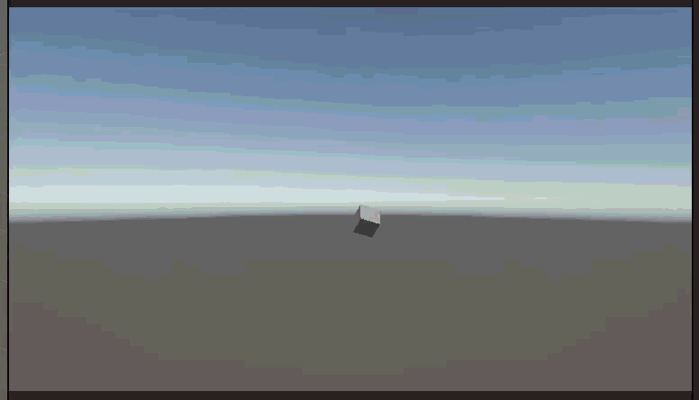

# Taller Transformaciones

**Estudiante:** Angel Santiago Avendaño
**Fecha de entrega:** 2026-02-21

## Descripción

Este taller explora los conceptos fundamentales de **transformaciones geométricas** (traslación, rotación y escala) aplicadas a objetos 3D en tiempo real. El objetivo es implementar un "Hola Mundo Visual" donde un objeto 3D recibe las tres transformaciones simultáneamente, animadas en función del tiempo.

Se implementó el ejercicio en **Unity (LTS)** con un cubo al que se le aplican traslación aleatoria por eje, rotación constante dependiente de `Time.deltaTime` y escalado oscilante con `Mathf.Sin(Time.time)`.

## Implementaciones

### Unity (LTS)

**Ubicación:** `unity/Transformaciones basica/`

#### Escena

Se creó un proyecto 3D vacío con Universal Render Pipeline. Se agregó un cubo a la escena (`GameObject > 3D Object > Cube`) y se le adjuntó el script `BasicTransformations.cs`.

#### Script de control

**`Assets/BasicTransformations.cs`**

Script adjunto al cubo que aplica las tres transformaciones en cada frame:

| Transformación | Método | Comportamiento |
|---|---|---|
| Traslación | `transform.Translate()` | Cada `translationInterval` segundos elige aleatoriamente eje X o Y, genera una posición aleatoria y se mueve suavemente hacia ella |
| Rotación | `transform.Rotate()` | Rotación continua en los 3 ejes escalada por `Time.deltaTime` |
| Escala | `transform.localScale` | Oscilación senoidal: `baseScale + Mathf.Sin(Time.time * frequency) * amplitude` |

Todos los parámetros son configurables desde el Inspector de Unity.

#### Características implementadas

- Traslación aleatoria por eje X o Y con interpolación suave hacia el objetivo
- Rotación constante en los 3 ejes, frame-rate independiente
- Escalado oscilante con función senoidal basada en `Time.time`
- Parámetros expuestos en el Inspector (rangos, velocidades, amplitud)

## Resultados Visuales

### Demostración de transformaciones básicas


*Cubo con traslación aleatoria, rotación continua y escala oscilante ejecutándose simultáneamente.*

## Código Relevante

### `BasicTransformations.cs` — Las tres transformaciones en tiempo real

```csharp
void HandleTranslation()
{
    translationTimer += Time.deltaTime;

    if (translationTimer >= translationInterval)
    {
        translationTimer = 0f;

        // Randomly choose X or Y axis for translation
        bool moveOnX = Random.value > 0.5f;
        float randomValue = Random.Range(-translationRange, translationRange);

        targetPosition = moveOnX
            ? new Vector3(randomValue, transform.position.y, transform.position.z)
            : new Vector3(transform.position.x, randomValue, transform.position.z);
    }

    Vector3 direction = targetPosition - transform.position;
    transform.Translate(direction * translationSpeed * Time.deltaTime, Space.World);
}

void HandleRotation()
{
    transform.Rotate(
        rotationSpeedX * Time.deltaTime,
        rotationSpeedY * Time.deltaTime,
        rotationSpeedZ * Time.deltaTime
    );
}

void HandleScale()
{
    float oscillation = Mathf.Sin(Time.time * scaleFrequency);
    float currentScale = baseScale + oscillation * scaleAmplitude;
    transform.localScale = new Vector3(currentScale, currentScale, currentScale);
}
```

## Aprendizajes y Dificultades

### Aprendizajes Clave

1. **`Time.deltaTime` para independencia de frame-rate:**
   Multiplicar la velocidad de rotación por `Time.deltaTime` garantiza que el movimiento sea consistente independientemente del rendimiento de la máquina. Sin esto, el objeto giraría más rápido en equipos potentes.

2. **`Space.World` vs `Space.Self` en `transform.Translate()`:**
   Usar `Space.World` hace que la traslación ocurra en el sistema de coordenadas global, por lo que el objeto se mueve en la misma dirección independientemente de su rotación. Con `Space.Self` el movimiento sería relativo a la orientación actual del objeto, lo que produce trayectorias irregulares al rotar.

3. **`Mathf.Sin` para animaciones cíclicas:**
   La función seno produce valores entre -1 y 1, lo que permite crear cualquier oscilación ajustando `baseScale` (centro) y `scaleAmplitude` (rango). La escala nunca llega a cero siempre que `amplitude < base`.

4. **Interpolación hacia objetivo en traslación:**
   En lugar de teletransportar el objeto a la nueva posición aleatoria, calcular la dirección y aplicar `Translate` cada frame produce un movimiento fluido. La velocidad de aproximación disminuye naturalmente al acercarse al destino.

### Dificultades Encontradas

1. **Escala negativa con amplitud alta:**
   - **Problema**: Si `scaleAmplitude >= baseScale`, el valor de escala puede volverse negativo o cero, invirtiendo o aplanando el objeto.
   - **Solución**: Mantener `scaleAmplitude` siempre menor que `baseScale`. Los valores por defecto (base=1, amplitude=0.4) garantizan que la escala oscile entre 0.6 y 1.4.

2. **Traslación errática con `Space.Self`:**
   - **Problema**: Al usar el espacio local, la dirección de movimiento cambiaba con cada frame de rotación, haciendo que el objeto no llegara al destino.
   - **Solución**: Cambiar a `Space.World` para que la traslación sea independiente de la orientación del objeto.

### Reflexión Personal

El taller demostró que las tres transformaciones fundamentales, aunque simples individualmente, producen comportamientos visuales complejos e interesantes cuando se combinan en tiempo real. La clave está en entender los espacios de coordenadas y cómo `Time.deltaTime` desacopla la lógica de animación del rendimiento del hardware.

## Estructura del Proyecto

```
semana_1_4_transformaciones/
├── unity/
│   └── Transformaciones basica/      # Proyecto Unity LTS
│       ├── Assets/
│       │   ├── BasicTransformations.cs
│       │   └── Scenes/
│       ├── Packages/
│       ├── ProjectSettings/
│       └── .gitignore
├── media/
│   └── demo.gif                      # Demostración del funcionamiento
└── README.md
```