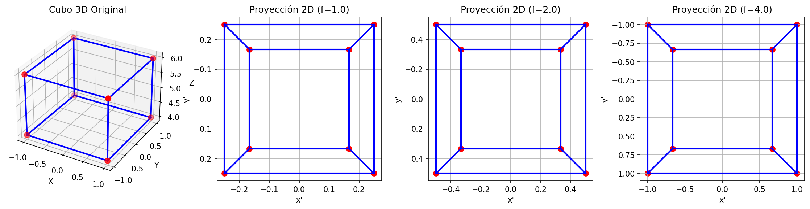
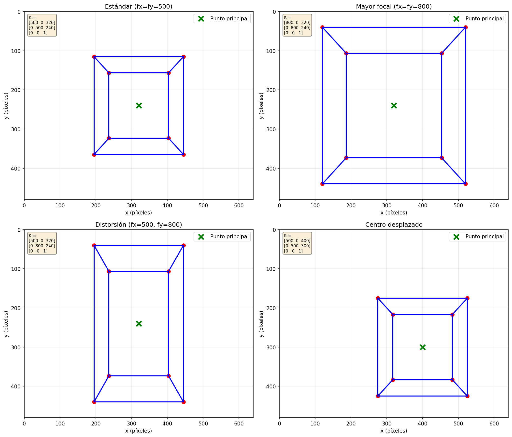
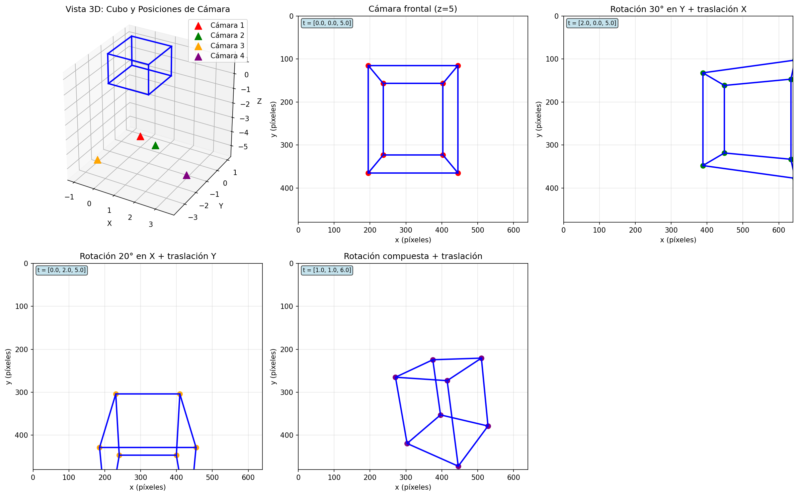
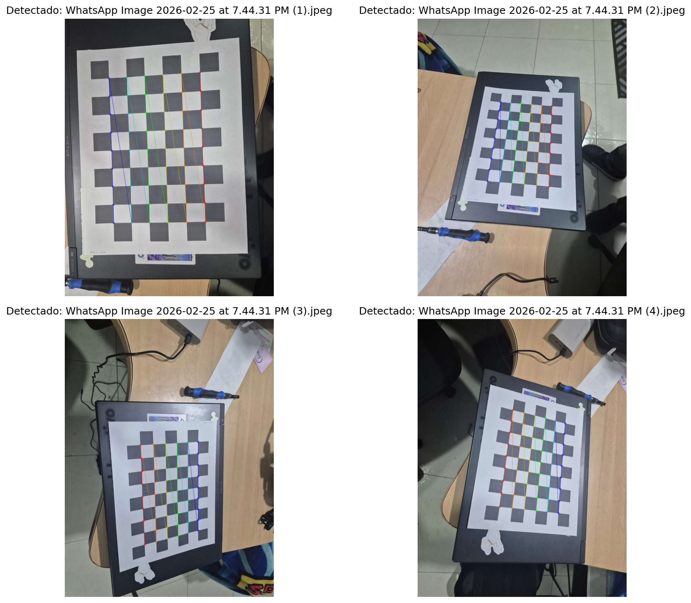
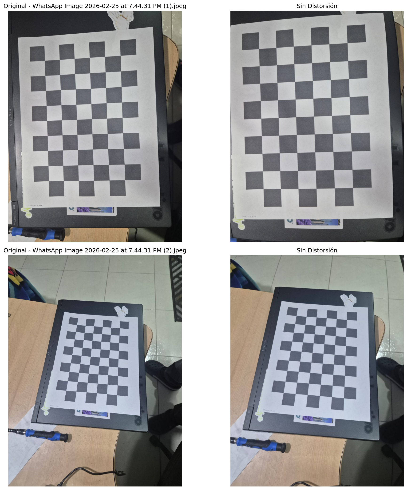
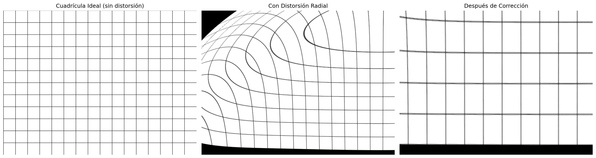
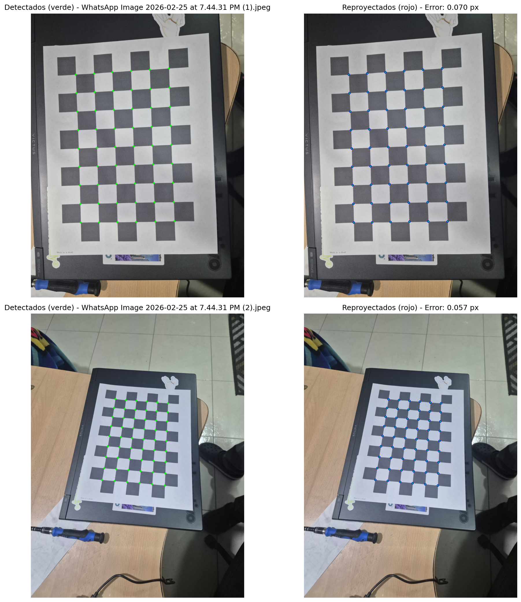
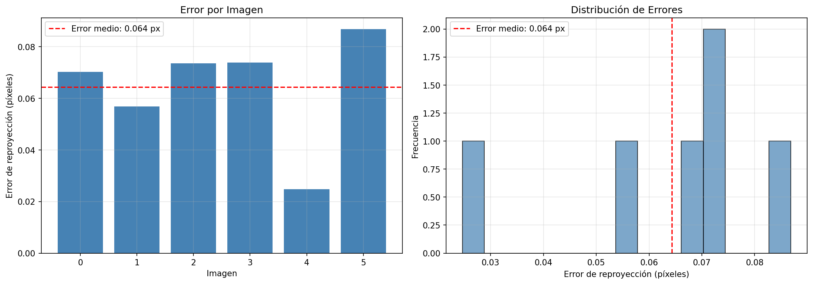

# Taller Cámara Pinhole y Calibración

## Información del estudiante
- **Nombre**: [Tu nombre]
- **Fecha de entrega**: [Fecha]

## Descripción

Este taller implementa el modelo matemático de cámara pinhole, comprende parámetros intrínsecos y extrínsecos, y realiza calibración de cámara usando patrones de ajedrez con corrección de distorsión y validación.

## Implementaciones

### Python (OpenCV y NumPy)

Se implementaron 6 módulos principales:

#### 1. Modelo de Cámara Pinhole (`1_pinhole_model.py`)
- Implementación desde cero de la proyección perspectiva
- Ecuaciones: `x' = f * X/Z`, `y' = f * Y/Z`
- Visualización de cubos 3D proyectados a 2D
- Comparación con diferentes distancias focales

#### 2. Parámetros Intrínsecos (`2_intrinsic_parameters.py`)
- Implementación de la matriz intrínseca K (3x3)
- Parámetros: fx, fy (focal length), cx, cy (punto principal)
- Visualización del efecto de diferentes parámetros en la proyección
- Demostración de distorsión por aspect ratio

#### 3. Parámetros Extrínsecos (`3_extrinsic_parameters.py`)
- Implementación de matrices de rotación (R) y traslación (t)
- Transformación de coordenadas del mundo a cámara
- Simulación de movimiento de cámara
- Visualización 3D de múltiples posiciones de cámara

#### 4. Calibración de Cámara (`4_camera_calibration.py`)
- Detección de esquinas en patrón de ajedrez usando `cv2.findChessboardCorners()`
- Calibración con `cv2.calibrateCamera()`
- Extracción de matriz intrínseca y coeficientes de distorsión
- Almacenamiento de parámetros de calibración

#### 5. Corrección de Distorsión (`5_undistortion.py`)
- Aplicación de `cv2.undistort()` con parámetros calculados
- Comparación lado a lado: original vs corregida
- Análisis del efecto en líneas rectas mediante cuadrículas
- Visualización de mejora en geometría

#### 6. Validación de Calibración (`6_calibration_validation.py`)
- Reproyección de puntos 3D conocidos
- Cálculo de error de reproyección (RMS)
- Visualización de puntos reproyectados vs detectados
- Evaluación de calidad de calibración

## Estructura del Proyecto

```
semana_2_3_camara_pinhole_calibracion/
├── python/
│   ├── 1_pinhole_model.py
│   ├── 2_intrinsic_parameters.py
│   ├── 3_extrinsic_parameters.py
│   ├── 4_camera_calibration.py
│   ├── 5_undistortion.py
│   ├── 6_calibration_validation.py
│   ├── main.py
│   ├── requirements.txt
│   └── calibration_params.npz (generado tras calibración)
├── media/
│   ├── 1_pinhole_projection.png
│   ├── 2_intrinsic_parameters.png
│   ├── 3_extrinsic_parameters.png
│   ├── 4_corner_detection.png
│   ├── 5_undistortion_comparison.png
│   ├── 5_distortion_grid.png
│   ├── 6_reprojection_error.png
│   └── 6_error_distribution.png
├── calibration_images/
│   └── (imágenes del patrón de ajedrez)
└── README.md
```

## Instalación y Uso

### Requisitos
```bash
cd python
pip install -r requirements.txt
```

### Ejecución

**Opción 1: Menú interactivo**
```bash
python main.py
```

**Opción 2: Scripts individuales**
```bash
# Paso 1: Modelo pinhole básico
python 1_pinhole_model.py

# Paso 2: Parámetros intrínsecos
python 2_intrinsic_parameters.py

# Paso 3: Parámetros extrínsecos
python 3_extrinsic_parameters.py

# Paso 4: Calibración (requiere imágenes en calibration_images/)
python 4_camera_calibration.py

# Paso 5: Corrección de distorsión (requiere calibración previa)
python 5_undistortion.py

# Paso 6: Validación (requiere imágenes en calibration_images/)
python 6_calibration_validation.py
```

### Preparación para Calibración

Para los pasos 4, 5 y 6, necesitas imágenes de un patrón de ajedrez:

1. Usa un patrón de ajedrez de 9x6 esquinas internas
2. Captura 10-20 imágenes desde diferentes ángulos
3. Guarda las imágenes en `calibration_images/` con formato `.jpg`
4. Asegúrate de que el patrón esté bien enfocado y visible

## Resultados Visuales

### 1. Proyección Pinhole con Diferentes Focales


*Visualización de un cubo 3D proyectado a 2D usando diferentes distancias focales (f=1.0, f=2.0, f=4.0). Se observa cómo mayor distancia focal produce menor perspectiva.*

### 2. Efecto de Parámetros Intrínsecos


*Comparación del efecto de diferentes parámetros intrínsecos en la proyección. Se visualiza el impacto de cambiar la distancia focal, el aspect ratio y el punto principal.*

### 3. Parámetros Extrínsecos y Movimiento de Cámara


*Demostración de cómo los parámetros extrínsecos (rotación y traslación) afectan la proyección. Incluye vista 3D de posiciones de cámara.*

### 4. Detección de Esquinas del Patrón


*Detección automática de esquinas en el patrón de ajedrez. Las esquinas detectadas se refinan con precisión subpixel.*

### 5. Corrección de Distorsión


*Comparación lado a lado de imágenes originales con distorsión vs imágenes corregidas.*



*Análisis del efecto de distorsión radial en una cuadrícula perfecta y su corrección.*

### 6. Validación: Error de Reproyección


*Visualización de puntos detectados (verde) vs puntos reproyectados (rojo). Las líneas amarillas muestran el error de reproyección.*



*Distribución estadística de los errores de reproyección por imagen y como histograma.*

## Código Relevante

### Proyección Pinhole Básica
```python
def project_pinhole(points_3d, focal_length):
    X = points_3d[:, 0]
    Y = points_3d[:, 1]
    Z = points_3d[:, 2]

    x_prime = focal_length * X / Z
    y_prime = focal_length * Y / Z

    return np.column_stack([x_prime, y_prime])
```

### Matriz Intrínseca
```python
def create_intrinsic_matrix(fx, fy, cx, cy):
    K = np.array([
        [fx, 0, cx],
        [0, fy, cy],
        [0, 0, 1]
    ])
    return K
```

### Transformación Mundo → Cámara
```python
def world_to_camera(points_world, R, t):
    points_camera = (R @ points_world.T).T + t
    return points_camera
```

### Calibración
```python
ret, K, dist, rvecs, tvecs = cv2.calibrateCamera(
    objpoints, imgpoints, image_size, None, None
)
```

## Prompts Utilizados

[Describir los prompts utilizados si se usó IA generativa para asistir en el desarrollo]

## Aprendizajes y Dificultades

### Aprendizajes

1. **Modelo Pinhole**: Comprendí cómo la geometría proyectiva transforma puntos 3D a 2D mediante división perspectiva.

2. **Parámetros Intrínsecos**: Aprendí que la distancia focal controla el nivel de zoom, mientras que el punto principal define el centro óptico de la imagen.

3. **Parámetros Extrínsecos**: Entendí que la matriz de rotación y el vector de traslación definen la pose de la cámara en el mundo.

4. **Calibración**: La calibración requiere múltiples vistas del patrón desde diferentes ángulos para obtener buenos resultados.

5. **Distorsión**: Los lentes reales introducen distorsión radial y tangencial que debe corregirse para aplicaciones precisas.

6. **Validación**: El error de reproyección es una métrica clave para evaluar la calidad de calibración (<0.5px es excelente, <1.0px es bueno).

### Dificultades

1. **Detección de patrones**: La detección de esquinas falla con iluminación pobre o desenfoque.

2. **Cantidad de imágenes**: Se necesitan suficientes imágenes (10-20) desde ángulos variados para calibración robusta.

3. **Precisión del patrón**: El patrón debe estar impreso con precisión para evitar errores sistemáticos.

4. **Convenciones de coordenadas**: Manejar las diferentes convenciones (OpenCV vs matemática) requiere cuidado.

## Referencias

- OpenCV Documentation: Camera Calibration
- Multiple View Geometry in Computer Vision (Hartley & Zisserman)
- OpenCV Python Tutorials
